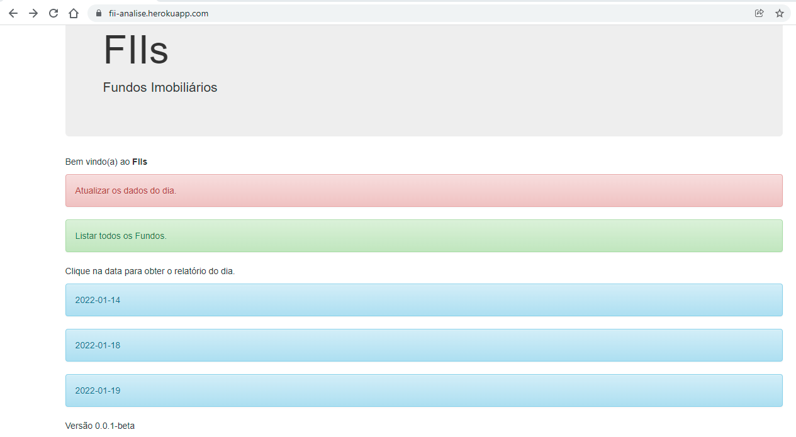
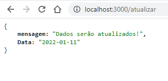
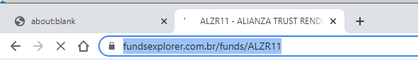
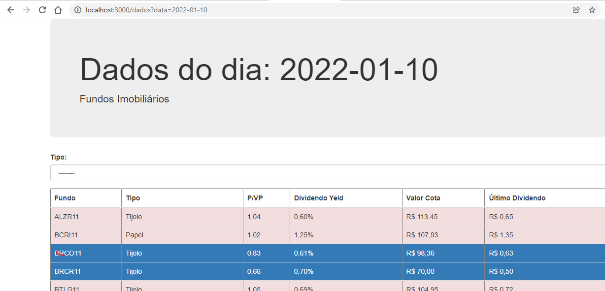

# Analise de Fundos Imobiliários por Scraper
*Repositório de Analise para FII - Fundos Imobiliários.*

## Instalação

```
npm install 
```

## Executar a aplicação

### Modo Desenvolvimento com Nodemon
```
npm run debug
```

### Modo Produção
```
npm run start
```

Acesse: http://localhost:3000/

### Lista de Fii - 11-01-2022
FII | Tipo |
--- | --- |
ALZR11 | Tijolo |
BCRI11 | Papel |
BRCO11 | Tijolo |
BRCR11 | Tijolo |
BTLG11 | Tijolo |
CORM11 | Tijolo |
CPTS11 | Papel |
CVBI11 | Papel |
DEVA11 | Papel |
GGRC11 | Tijolo |
HCTR11 | CRIs |
HGBS11 | Tijolo |
HGLG11 | Tijolo |
HGRE11 | Tijolo |
HGRU11 | Tijolo |
HSML11 | Tijolo |
IRDM11 | Papel |
KISU11 | Fundo de Fundos |
KNRI11 | Tijolo |
KNSC11 | Papel |
LGCP11 | Tijolo |
MALL11 | Tijolo |
MCCI11 | Papel |
MXRF11 | Papel |
RBRF11 | Fundo de Fundos |
RBRP11 | Tijolo |
RBRR11 | Papel |
RECR11 | Papel |
RRCI11 | Papel |
TORD11 | Híbrido |
VGIP11 | Papel |
VILG11 | Tijolo |
VISC11 | Tijolo |
VSLH11 | Híbrido |
XPLG11 | Tijolo |
XPML11 | Tijolo |

### Adicionar novos FIIs para analise, diretamente no arquivo pageController.js

## Funcionalidades
- Tela Inicial - Botão para atualizar a situação dos FIIs na data corrente via scraper;  


- Tela de Atualização - Processo em background para atualizar as informações;    



*Obs.: Não pode fechar o navegador que vai abrir.*    


- Relatório de FII por data - P/VP abaixo de 1 linha em azul, P\VP acima de 1 linha vermelha.  

